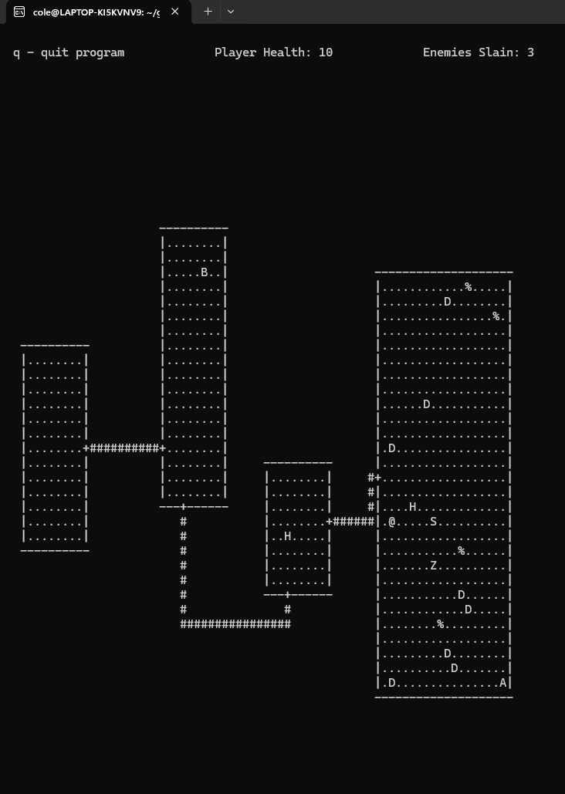

IMPORTANT READ FIRST
1. The Cedrien account is my github account provided by the school.

Personal Contributions To The Project
1. Enemy movement.
2. Player movement.
3. Enemy and item collision detection with the player.
4. A SQL driven backend which stores data on all objects in the game (enemy health, death status, damage values).
5. A plethora of SQL queries and updates to manipulate or fetch column entries.
6. Enemy and item design and balancing.
7. A logger that records every interaction in the game (movement, collision, and game state).
8. Enemy and item rendering as well as removal.
9. Health and enemies slain counters.
10. Amulet of Yendor item that displays a win screen.
11. Death Screen.
12. The ability to run several instances of the game at once.

How To Run The Project Locally
1. Clone the remote repository using the URL provided.
2. Open the project in CLion so that the cmake-build-debug directory is automatically generated.
3. cd to the database directory, and then run from the command line make drop and then make build (cat the makefile to see more details).
4. From CLion use the build hammer on the rogue target.
5. From the root of the directory run cmake-build-debug/rogue.
6. Try out our game!

